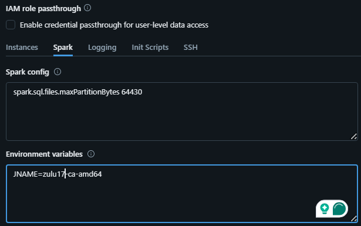
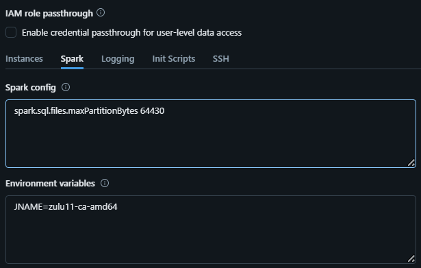

# Geo Addressing SDK Sample for Databricks
This sample for Databricks demonstrates how to install, configure, and execute an addressing process of Geo Addressing SDK in Databricks with PySpark.

## 1. Starting the Cluster
Since Geo Addressing SDK for Big Data release 5.2.1, the SDK requires JDK 11 (jdk-8 is no logner supported), you need to create the cluster with your required configuration along with JDK 11.
To enable JDK 11, you can pass the `JNAME` as environment variable:

- Since Databricks Runtime Version 15.*:
Use `JNAME=zulu17-ca-amd64` to enable Java 17 (Java 11 is not readily available)

  

- For Databricks Runtime Version below 15.* 
Use `JNAME=zulu11-ca-amd64` to enable Java 11
  

**NOTE**: Using `spark.sql.files.maxPartitionBytes=64430`, we have observed the best performance for Geo Addressing SDK in Databricks. (You can create optimal partitions as per your requirements) 

## 2. Installing Reference Data

**NOTE**: We recommend to download, extract and configure the Geo Addressing Reference Data before running the Geo Addressing Application, as downloading at runtime will create performance issues.

Collect your Data Experience API Key and Secret Key by visiting https://data.precisely.com/autodownload.  You will need these for the Addressing Installation notebook.

Import the [Installation Guide Notebook](./Installing_SDK_and_Reference_Data.ipynb) in your Databricks account and follow the instructions by replacing the variables to install the reference data.

The Addressing Installation notebook contains the commands necessary to install the addressing libraries and reference data. The first command provides configuration variables for the notebook and will need to be updated with values specific to your environment. After updating the configuration section, you can execute each cell individually or run the entire notebook to perform the installation.

You will also need to provide the URL for the location of the Geo Addressing SDK for Big Data product distribution. You should be able to find this URL in your product delivery email from Precisely. See these links for information on creating AWS presigned https://docs.aws.amazon.com/cli/latest/reference/s3/presign.html , and for Azure https://docs.microsoft.com/en-us/rest/api/storageservices/Service-SAS-Examples?redirectedfrom=MSDN . If you prefer, you may manually copy the product distribution to your dbfs and use a file:///dbfs/<path_on_dbfs> URL.

Once those changes have been made, you can execute the cell.
The rest of the cells can be executed in order.

**NOTE**: This sample integrates Databricks with the Precisely Data Experience in order to access and configure your licensed reference data, which is required for running the geocoder.  Using your credentials you will be assured to be using the most recent data vintage.  This also expedites the setting up of data on your cluster.

## 3. Installing the Geo Addressing SDK Jar File in the Cluster

<strong> After executing the Installation Guide Notebook</strong>, you will see a jar called out in the results.  

That jar should be added as a library to your cluster https://docs.databricks.com/libraries/index.html.

**NOTE**: The sdk jar library for pyspark and scala notebooks to be attached is same.

## 4. Running the Geo Addressing Application

A sample notebook is provided along with required code snippts to run the Geo Addressing in Databricks for geocoding.

If you are using PySpark, follow [Geo_Addressing_Demo Notebook](./pyspark/Geo_Addressing_Demo.ipynb) for executing Geo Addressing Application.

If you are using Scala, follow [Geo_Addressing_Demo Notebook](./scala/Geo_Addressing_Demo.scala) for executing Geo Addressing Application.
