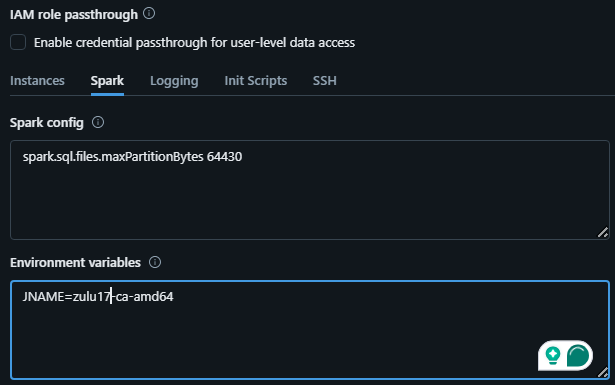

# Geo Addressing SDK for Big Data in Databricks
This sample for Databricks demonstrates how to install, configure, and execute an geo addressing capabilities of Geo Addressing SDK in Databricks.

> **NOTE: For Dtabricks Unity Catalogue Shared Compute, the Geo Addressing SDK for Big Data is not supported because of the architecture limitations on Shared Compute. We recommend using Personal or Single User Compute for running the Geo Addressing SDK for Big Data.**

## Getting Started

Below are the steps mentioned to get started with using Geo Addressing SDK for Big Data in Databricks.

## 1. Start the Compute/Cluster

Refer to the [version chart](#version-chart) at the end of this document 
to determine the appropriate java and scala versions for your Geo Addressing SDK for Big Data version.

Use `JNAME=zulu17-ca-amd64` to enable Java 17.



## 2. Uploading the Geo Addressing SDK for Big Data product zip to Databricks

Download the Geo Addressing SDK for Big Data product zip (geo-addressing-bigdata-distribution-<version>.zip) to your local environment. You should be able to find the URL for downloading the product distribution zip in your product delivery email from Precisely.

You need to extract and manually upload the contents of the distribution zip to Databricks.

```shell
unzip geo-addressing-bigdata-distribution-<version>.zip -d ./geo-addressing-bigdata-distribution-<version>
```

### Option1: Uploading using Databricks CLI

You can use Databricks CLI to upload the contents of the product distribution zip to DBFS or volumes as follows:
- Install Databricks CLI and add authentication. Refer [install cli](https://docs.databricks.com/aws/en/dev-tools/cli/install) documentation for more information.
- Use Databricks Copy Command for Copying the extracted SDK contents as follows:
```shell
databricks fs cp --recursive ./geo-addressing-bigdata-distribution-<version>/ dbfs:<your path e.g. /addressing/sdk>/geo-addressing-bigdata-distribution-<version>/
```

### Option2: Using Mounted Cloud Storage on Databricks

Databricks enables users to mount cloud object storage to the Databricks File System (DBFS).
Follow the below steps for uploading the distribution contents to Databricks:
- Refer to [mounting cloud storage](https://docs.databricks.com/aws/en/dbfs/mounts) documentation by Databricks to mount your cloud storage path.
- Upload the extracted contents of the distribution zip to your cloud storage.
- Use databricks mount utility for directly loading into your databricks path. e.g. to load the sdk contents from S3, you can use the following code block:
```shell
dbutils.fs.mount(
  source = "s3a://<your-bucket>/geo-addressing-bigdata-distribution-<version>/", 
  mountPoint = "/mnt/<your-path>/geo-addressing-bigdata-distribution-<version>/"
)
```

## 3. Installing the product SDK Jar as a Library in your Cluster

Once you copy the extracted distribution contents to databricks, you have to install the product sdk jar to Databricks as a Library.
The jar to be available at `<databricks-path>/geo-addressing-bigdata-distribution-<version>/spark/sdk/lib/geo-addressing-bigdata-addressing-sdk-spark2.13-<version>.jar` according to your cluster scala versions. Refer the [version chart](#version-chart) to decide which jar you should upload according to your cluster requirements.

**NOTE: You might need to copy the SDK jar to your user's Workspace as Databricks doesn't allow installing jar from DBFS path. Refer to [this documentation](https://docs.databricks.com/aws/en/libraries/#java-and-scala-library-support) for more information on installing library in the cluster.**


## 4. Installing Reference Data

**NOTE**: We recommend to extract the reference data during runtime, as pre-downloading or pre-extracting at dbfs path or volumes will create performance issues.

- Collect your Data Experience API Key and Secret Key by visiting https://data.precisely.com/autodownload.  You will need these for the Addressing Installation notebook.

- Import the [Installation Guide Notebook](./Installing_SDK_and_Reference_Data.ipynb) in your Databricks account and follow the instructions by replacing the variables to install the reference data.
The Addressing Installation notebook contains the commands necessary to install the addressing libraries and reference data. The first command provides configuration variables for the notebook and will need to be updated with values specific to your environment. After updating the configuration section, you can execute each cell individually or run the entire notebook to perform the installation.

- Once those changes have been made, you can execute the cell.
The rest of the cells can be executed in order.


**NOTE**: This sample integrates Databricks with the Precisely Data Experience in order to access and configure your licensed reference data, which is required for running the geocoder.  Using your credentials you will be assured to be using the most recent data vintage.  This also expedites the setting up of data on your cluster.


## 4. Running the Geo Addressing Application


A sample notebook is provided along with required code snippts to run the Geo Addressing in Databricks for geocoding.

For PySpark, refer [Geo_Addressing_Demo Notebook](./pyspark/Geo_Addressing_Demo.ipynb) for executing Geo Addressing Application.

For Scala, refer [Geo_Addressing_Demo Notebook](./scala/Geo_Addressing_Demo.scala) for executing Geo Addressing Application.


# Useful Links and References

Refer the following links for more information about Geo Addressing SDK for Big Data and it's usage:

- [Product User Guide](https://help.precisely.com/r/p/Geo-Addressing-SDK-for-Big-Data/pub/5.2.2/en-US/Geo-Addressing-SDK-for-Big-Data-Guide)
- [Reference Documentation Landing Page](https://docs.precisely.com/docs/sftw/hadoop/landingpage/index.html)


# Version Chart

Refer to the following chart for GA-SDK version against Geo Addressing SDK for Big Data Version.

| Geo Addressing SDK for Big Data Version | GA-SDK Version | JDK Version | Scala Version |
|-----------------------------------------|----------------|-------------|---------------|
| 5.1.0.8 - 5.1.0.10                      | 5.1.27         | 8           | 2.12          |
| 5.1.0.11                                | 5.1.682        | 8           | 2.12          |
| 5.2.0.0                                 | 5.1.796        | 8           | 2.12          |
| 5.2.1                                   | 5.1.854        | 11          | 2.12          |
| 5.2.2                                   | 11.1.1250      | 11          | 2.12          |
| 11.2.0                                  | 11.2.228       | 17          | 2.12, 2.13    |
| 11.2.1                                  | 11.2.463       | 17          | 2.12, 2.13    |
| 11.2.2                                  | 11.2.690       | 17          | 2.12, 2.13    |
| 11.2.3                                  | 11.2.801       | 17          | 2.12, 2.13    |
