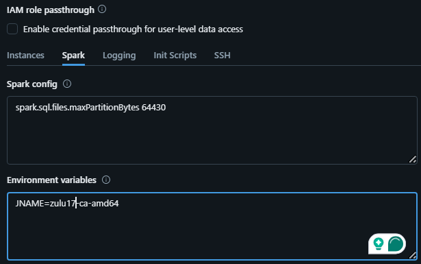
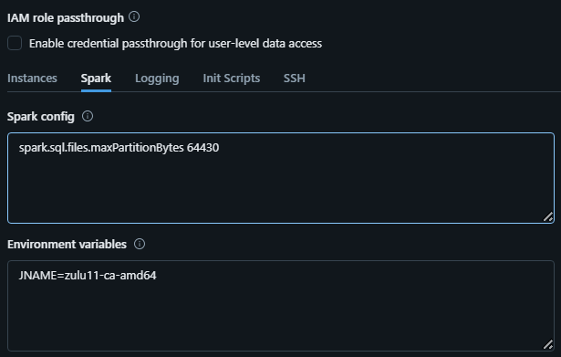

# Location Intelligence SDK Sample for Databricks
This sample for Databricks demonstrates how to install, configure, and execute Spatial operations of Location Intelligence SDK in Databricks with PySpark.

## 1. Starting the Cluster
Since Location Intelligence SDK for Big Data release 5.2.1, the SDK requires JDK 11 (jdk-8 is no longer supported), you need to create the cluster with your required configuration along with JDK 11.
To enable JDK 11, you can pass the `JNAME` as environment variable:

- Since Databricks Runtime Version 15.*:
Use `JNAME=zulu17-ca-amd64` to enable Java 17 (Java 11 is not readily available)

  

- For Databricks Runtime Version below 15.* 
Use `JNAME=zulu11-ca-amd64` to enable Java 11
  

**NOTE**: Using `spark.sql.files.maxPartitionBytes=64430`, we have observed the best performance for Location Intelligence SDK in Databricks. (You can create optimal partitions as per your requirements) 

## 2. Installing the Location Intelligence SDK Jar File in the Cluster

<strong> After executing the Installation Guide Notebook</strong>, you will see a jar called out in the results.  

That jar should be added as a library to your cluster https://docs.databricks.com/libraries/index.html.

**NOTE**: The sdk jar library for pyspark and scala notebooks to be attached is same.

## 3. Running the Location Intelligence Application for Big Data

A sample notebook is provided along with required code snippets  to run the Location Intelligence for Big data in Databricks. These samples demonstrates using location intelligence for big data to run spatial geometry operations using spark sql in scala or python notebooks. We can also run spatial operations like Point in Polygon, Search Nearest, Join by Distance and Hexgen as Spark drivers using Spark submit job.

If you are using PySpark,follow :

  [Location Intelligence Notebook for Spark Drivers](./pyspark/LI-SDK-Drivers-Pyspark.ipynb) for executing Spatial operations as Spark drivers.
  [Location Intelligence Notebook for Spark SQL](./pyspark/LI-SDK-UDF-Pyspark.ipynb) for executing Spatial operations as Spark SQL.

If you are using Scala,follow :

  [Location Intelligence Notebook for Spark Drivers](./scala/LI-JoinByDistance.scala) for executing Spatial Join by distance operation.
  [Location Intelligence Notebook for Spark Drivers](./scala/PointInPolygon.scala) for executing Spatial Point in polygon operation.
  [Location Intelligence Notebook for Spark Drivers](./scala/SearchNearest.scala) for executing Spatial Search Nearest operation.
  [Location Intelligence Notebook for Spark Drivers](./scala/Hexgen.scala) for executing Spatial HexGenerator operation.
  [Location Intelligence Notebook for Spark SQL](./scala/Spark-sql-functions.scala) for executing Spatial operations as Spark SQL.

